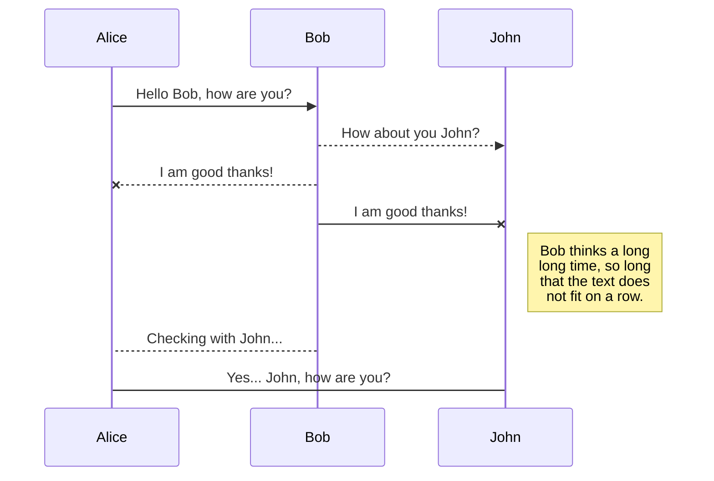

## Hello World!

This is a test

Lorem ipsum dolor sit amet, consectetur adipiscing elit. Ut non lorem diam. Quisque vulputate nibh sodales eros pretium tincidunt. Aenean porttitor efficitur convallis. Nulla sagittis finibus convallis. Phasellus in fermentum quam, eu egestas tortor. Maecenas ac mollis leo. Integer maximus eu nisl vel sagittis.

Suspendisse facilisis, mi ac scelerisque interdum, ligula ex imperdiet felis, a posuere eros justo nec sem. Nullam laoreet accumsan metus, sit amet tincidunt orci egestas nec. Pellentesque ut aliquet ante, at tristique nunc. Donec non massa nibh. Ut posuere lacus non aliquam laoreet. Fusce pharetra ligula a felis porttitor, at mollis ipsum maximus. Donec quam tortor, vehicula a magna sit amet, tincidunt dictum enim. In hac habitasse platea dictumst. Mauris sit amet ornare ligula, blandit consequat risus. Duis malesuada pellentesque lectus, non feugiat turpis eleifend a. Nullam tempus ante et diam pretium, ac faucibus ligula interdum.

added some extra text

